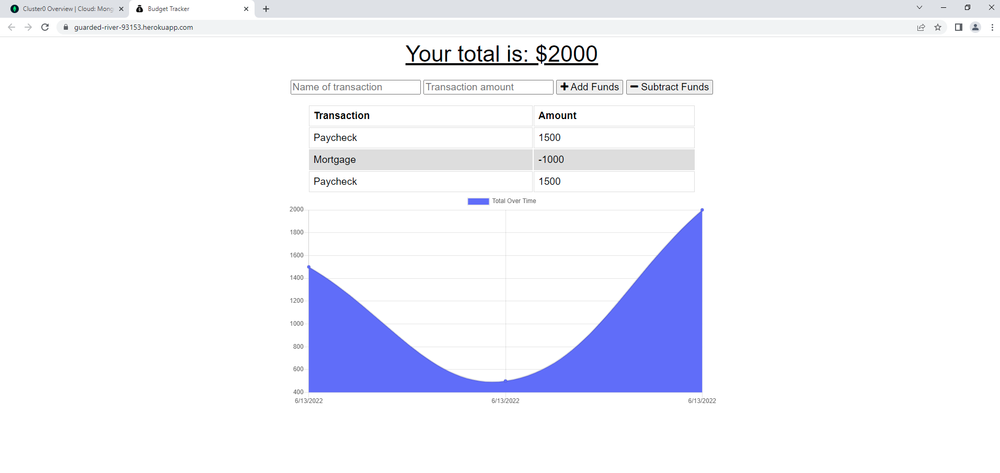

# budget-track-attack

# Awesome Team Directory
    

## Description

This is a budget tracker application that allows for offline access and functionality. Users will be able to add expenses and deposits to their budget with or without a connection. If the user enters transactions offline, the total should be updated when they're brought back online. The application is deployed through Heroku at: https://guarded-river-93153.herokuapp.com/

## Table of Contents

- [Description](#description)
- [Installation](#installation)
- [Usage](#usage)
- [License](#license)
- [Contributing](#contributing)
- [Tests](#tests)
- [Questions](#questions)

## Installation

Run "npm install" to install the required packages.

## Usage

Run "server.js" from the command line and visit https://localhost:3001 or simply visit the deployed application at https://guarded-river-93153.herokuapp.com/.

## License

This application is covered by the MIT license. 

For more information about this license please visit [https://choosealicense.com/licenses/mit/]

## Contributing

There were no collaborators on this project.

## Tests

There were no tests written for this project.

## Questions

Find me on GitHub: [https://github.com/uncgirl02](https://github.com/uncgirl02)

Email me with any questions: ems1980@hotmail.com
    

